# Synthetic Data Pipeline Agents

Staged synthetic-data pipeline for creating benchmark cases with strong role
separation, router-owned transitions, structured run logs, and offline
diversity/quality analysis.

The primary target is narrow on purpose:

- Generate one committed JSONL dataset of benchmark cases.
- Emit one structured Stage Run Log JSONL file per run.
- Compute offline diversity and quality-proxy metrics over the dataset and log.
- Preserve the core discipline: producers create, judges classify, the router
  owns state transitions.

## What This Is

This is a LangGraph-style pipeline with domain-agnostic agent roles and
domain-specific contracts. The current benchmark contracts generate cases where:

```text
score X on benchmark B should be a strong proxy for ability Z in environment Y
```

Each committed case carries the benchmark prompt/setup, target ability,
environment assumptions, scoring contract, proxy claim, diagnostic pressure,
leakage risks, known limits, coverage tags, and controls.

The repo is organized around a router-owned stage graph:

```mermaid
flowchart LR
  START((START)) --> Design["Design<br/>Designer"]
  Design -->|"design batch"| DesignCheck["Batch design check<br/>deterministic"]
  DesignCheck -->|"accept"| SelectDesign["Select next design"]
  DesignCheck -->|"reject / retry"| Design
  SelectDesign -->|"design available"| DesignAudit["Design audit<br/>DesignAuditor"]
  SelectDesign -->|"queue empty"| Design
  DesignAudit -->|"accept"| Generate["Generate sample<br/>SampleGenerator"]
  DesignAudit -->|"reject design"| Drop["Archive rejection"]
  Generate -->|"accept"| DetVal["Deterministic validation"]
  Generate -->|"retry_*"| Generate
  DetVal -->|"accept, adversary pending"| Adversary["Adversary<br/>attack search"]
  DetVal -->|"accept, adversary done"| QualityGate["Quality gate<br/>benchmark proxy"]
  DetVal -->|"accept, adversary done"| RubricGate["Rubric gate<br/>scoring reliability"]
  DetVal -->|"reject / retry"| Generate
  Adversary -->|"revision needed"| Revise["Revise from adversary"]
  Adversary -->|"accept"| QualityGate
  Adversary -->|"accept"| RubricGate
  Revise --> DetVal
  QualityGate --> JoinGates["Join gates"]
  RubricGate --> JoinGates
  JoinGates -->|"accept"| Curate["Curate corpus"]
  JoinGates -->|"reject / retry"| Generate
  Curate -->|"accept"| Commit["Commit sample"]
  Curate -->|"reject_duplicate"| Drop
  Commit -->|"target_n reached"| END((END))
  Commit -->|"more designs queued"| SelectDesign
  Commit -->|"need fresh design"| Design
  Drop -->|"continue if possible"| SelectDesign

  classDef startEnd fill:#0f766e,stroke:#0f766e,color:#ffffff,stroke-width:2px;
  classDef llm fill:#eff6ff,stroke:#2563eb,color:#0f172a,stroke-width:2px;
  classDef det fill:#f0fdf4,stroke:#16a34a,color:#0f172a,stroke-width:2px;
  classDef router fill:#fff7ed,stroke:#ea580c,color:#0f172a,stroke-width:2px;
  classDef artifact fill:#f8fafc,stroke:#64748b,color:#0f172a,stroke-width:2px;
  classDef reject fill:#fff1f2,stroke:#e11d48,color:#0f172a,stroke-width:2px;
  class START,END startEnd;
  class Design,DesignAudit,Generate,Adversary,Revise,QualityGate,RubricGate llm;
  class DesignCheck,DetVal,Curate det;
  class SelectDesign,JoinGates router;
  class Commit artifact;
  class Drop reject;
```



See [docs/PIPELINE_STATE_MACHINE.md](docs/PIPELINE_STATE_MACHINE.md) for the
full stage and route diagram and [docs/PIPELINE_REFERENCE.md](docs/PIPELINE_REFERENCE.md)
for the runtime artifact reference.

## Core Principles

- Engineered diversity beats emergent diversity.
- Agents do not manage pipeline state.
- Judges never create, repair, or rewrite upstream artifacts.
- Route codes are fixed, inspectable, and used for routing.
- Stage Run Logs are first-class data, not incidental telemetry.
- Run output must come from the same pipeline path used for production runs.

## Repo Map

```text
main.py                  # CLI entrypoint
cli_graph.py             # Optional live progress graph for terminal runs
pipeline.py              # Pipeline nodes, edges, retry policy
pipeline_transitions.py  # Pure graph transition functions
pipeline_helpers.py      # Progress, error, and output helpers
agents.py                # Agent role implementations
agent_constants.py       # Static prompt, taxonomy, and retry guidance data
model_client.py          # LangChain/OpenAI-compatible provider orchestration
model_helpers.py         # Shared model config coercion helpers
codex_client.py          # Codex subscription transport
structured_output.py     # Structured-response parsing and schema normalization
structured_schemas.py    # JSON-schema builders for agent outputs
generation_artifacts.py  # Candidate shaping, workspace tools, revision patches
router.py                # Route table and context policies
rules.py                 # Deterministic benchmark schema and contract checks
models.py                # Pydantic artifact and event schemas
config.py                # CLI/env/domain config resolution
observability.py         # StageRecord JSONL writer
text_hygiene.py          # Provider text normalization and disallowed-char checks
analyze.py               # Offline diversity and quality metrics
run_report.py            # Human-readable run summaries
sample_outputs.py        # Sample model outputs for committed benchmark prompts

services/
  execution_workspace.py # Executioner-backed durable workspace sessions
  environment_validation.py # Workspace/runtime validation
  runtime_requirements.py   # Portable runtime contract validation
  corpus_index.py        # Embeddings and nearest-neighbor novelty checks
  coverage_ledger.py     # Taxonomy-cell coverage counts
  validation_ledger.py   # Verdict trail
  rejection_archive.py   # Rejected artifacts and evidence

domains/
  benchmark_haiku.yaml   # Haiku benchmark domain contract
  benchmark_code_debug.yaml # Code-debug benchmark domain contract

tests/
  test_router.py
  test_rules.py
  test_schemas.py
  test_pipeline_smoke.py
```

## CLI

Run the deterministic suite first, then run a small live smoke with a fresh
`--run-id`:

```bash
python3 -m venv .venv
source .venv/bin/activate
pip install -r requirements.txt
export OPENAI_API_KEY=...
pytest
python3 main.py --domain domains/benchmark_haiku.yaml --target-stage benchmark --target-n 5 --seed 42 --run-id smoke-run
python3 analyze.py --run-id smoke-run
python3 run_report.py smoke-run
python3 sample_outputs.py smoke-run --limit 1
```

Useful runtime flags:

```bash
python3 main.py \
  --domain domains/benchmark_code_debug.yaml \
  --target-stage benchmark \
  --target-n 3 \
  --seed 42 \
  --run-id code-smoke \
  --provider openai \
  --model gpt-5.5
```

- `--no-progress` disables the terminal graph.
- `--overwrite` replaces existing artifacts for the run id.
- `--auth-file` points Codex subscription auth at a non-default auth file.

Each live run writes inspectable artifacts on disk:

```text
data/corpus/benchmark/smoke-run.jsonl
logs/smoke-run/stage_records.jsonl
logs/smoke-run/validation.jsonl
logs/smoke-run/rejections.jsonl
logs/smoke-run/metrics.json
data/outputs/smoke-run.jsonl
```

`main.py` refuses to reuse a run id when matching logs or corpus files already
exist. Use a new `--run-id`, or pass `--overwrite` when you intentionally want
to replace that run's artifacts.

No checked-in static output should be presented as a successful run. The smoke
run requires actual API credentials and must make live provider calls for the
LLM stages. Test doubles are allowed only inside tests.

## Environment

Live runs use real provider calls for LLM stages. You can put credentials and
model settings in `.env` at the repo root:

```text
OPENAI_API_KEY=sk-...
MODEL_PROVIDER=openai
MODEL_NAME=gpt-5.5
MODEL_REASONING_EFFORT=medium
EMBEDDING_PROVIDER=local
EMBEDDING_MODEL=local-hash-embedding
```

Gemini models are supported through Google's OpenAI-compatible Gemini API
endpoint. Put `GEMINI_API_KEY` in `.env` and select the Gemini provider:

```text
GEMINI_API_KEY=...
MODEL_PROVIDER=gemini
MODEL_NAME=gemini-3.1-flash-lite
```

When `MODEL_PROVIDER=gemini` and `MODEL_BASE_URL` is unset, the pipeline uses
`https://generativelanguage.googleapis.com/v1beta/openai/`.

xAI/Grok models are supported through LangChain's xAI integration. Use either
`XAI_API_KEY` or `GROK_API_KEY`:

```text
GROK_API_KEY=...
MODEL_PROVIDER=xai
MODEL_NAME=grok-4.3
```

By default, embeddings use a local deterministic hash vector for novelty checks.
Set `EMBEDDING_PROVIDER=openai` explicitly only when you want curation to call a
remote embedding API.

For Codex subscription auth, use the Codex provider and either rely on the
default auth file at `~/.codex/auth.json` or pass an explicit path:

```bash
MODEL_PROVIDER=codex MODEL_NAME=gpt-5.5 python3 main.py \
  --domain domains/benchmark_haiku.yaml \
  --target-n 1 \
  --run-id codex-smoke \
  --auth-file ~/.codex/auth.json
```

See `.env.example` for optional model and base URL overrides. Values already
exported in your shell take precedence over `.env`.

## Release Check

The deterministic tests run without provider credentials. Before sending this
repo out, run `pytest` and at least one live smoke. A smoke may use a tiny target
count, but it must exercise the same node, route, logging, and artifact paths as
a full run.
