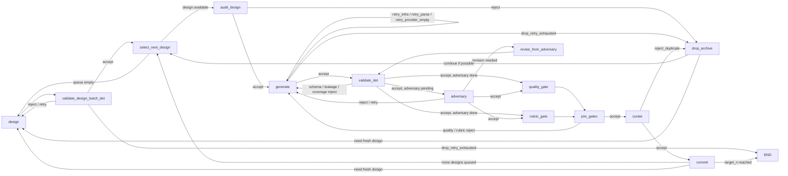

# Pipeline Reference

A single-page guide to runtime nodes, route codes, context policies, and retry bounds.

---

## Runtime Graph



Every stage writes one `StageRecord` to `logs/<run_id>/stage_records.jsonl`.

---

## Node Quick Reference

```
  Node                        fn name                    Role              Det/LLM
  ──────────────────────────────────────────────────────────────────────────────────
  Design                    design                   Designer        LLM
  Batch design check            validate_design_batch_det     —                 Det
  Select next design            select_next_design           —                 Det (queue)
  Design audit             audit_design            DesignAuditor       LLM
  Generate sample             generate                   SampleGenerator   LLM
  Deterministic validation    validate_det               —                 Det
  Adversary search            adversary                  Adversary         LLM
  Adversary revision          revise_from_adversary      Revisor           LLM
  Quality gate                quality_gate               QualityGate       LLM
  Rubric gate                 rubric_gate                RubricGate        LLM
  Gate join                   join_gates                 —                 Det (router)
  Curate corpus               curate                     —                 Det
```

---

## Route Codes

### Accept

```
  accept                      Artifact passes all criteria; advance to next stage.
```

### Content / criteria failures  ← these trigger FRESH resample

```
  reject_criteria_mismatch    Failed a stated evaluation criterion       quality/rubric gate
  reject_schema               Artifact violates JSON/Pydantic schema     det validator
  reject_leakage              Label/answer appears verbatim in inputs    det validator
  reject_duplicate            Embedding distance below novelty τ         batch design check · curator
  reject_coverage_mismatch    Taxonomy cell saturated or mismatched      batch design check · det validator
  reject_semantic_mismatch    Semantic rule violated (LLM judgment)      adversary/quality/rubric gate
  reject_upstream_invariant   Should have failed an earlier stage        any judge
```

### Infra / execution failures  ← these trigger SAME_INPUT_RETRY

```
  retry_infra                 Network error · timeout · provider failure
  retry_parse                 Response didn't parse into expected schema
  retry_provider_empty        Valid but empty provider response
```

### Terminal outcomes

```
  drop_retry_exhausted        Retry ceiling hit; artifact discarded
  drop_timeout                Wall-clock timeout exceeded
  drop_policy_ceiling         Run-level drop ceiling exceeded
```

---

## Context Policies

```
  Policy                  Used when                               What the producer sees
  ─────────────────────────────────────────────────────────────────────────────────────
  FRESH                   Pure resample after content rejection   Criteria only — no failure context
  SAME_INPUT_RETRY        Infra / parse / provider-empty          Identical input, no failure context
  CRITERIA_ONLY           Any judge invocation                    Artifact + criteria only
  CRITERIA_PLUS_ROUTE_CODE Content retry after rejection         Criteria + route code + subcodes
```

---

## Routing Transitions

### Planning batch

```
  design
    ├─ (batch emitted) ──────────────────────────────► validate_design_batch_det
    └─ retry_provider_empty (still routed through batch check)

  validate_design_batch_det
    ├─ accept ───────────────────────────────────────► select_next_design
    ├─ reject_coverage_mismatch  }
    │  reject_duplicate          }  retry < max_design_retries  ──► design  [FRESH]
    └─ drop_retry_exhausted ─────────────────────────► END  (drop batch)
```

### Design loop

```
  select_next_design
    ├─ design available ───────────────────────────────► audit_design
    └─ queue empty · target not met ────────────────► design

  audit_design
    ├─ accept ───────────────────────────────────────► generate
    └─ reject_* ─────── archive ─────────────────────► select_next_design  (or design)

  generate
    ├─ accept ───────────────────────────────────────► validate_det
    ├─ retry_infra / retry_parse / retry_provider_empty
    │    retry < max_generation_retries  ────────────► generate  [SAME_INPUT_RETRY]
    └─ drop_retry_exhausted ─────── archive ─────────► select_next_design

  validate_det
    ├─ accept + adversary pending ───────────────────► adversary
    ├─ accept + adversary done ──────────────────────► quality_gate + rubric_gate
    ├─ reject_schema / reject_leakage / reject_coverage_mismatch
    │    retry < max_generation_retries  ────────────► generate  [FRESH]
    └─ drop_retry_exhausted ─────── archive ─────────► select_next_design

  adversary
    ├─ accept ───────────────────────────────────────► quality_gate + rubric_gate
    ├─ revision needed ──────────────────────────────► revise_from_adversary
    ├─ reject_criteria_mismatch / reject_semantic_mismatch
    │    retry < max_generation_retries  ────────────► generate  [FRESH]
    └─ drop_retry_exhausted ─────── archive ─────────► select_next_design

  revise_from_adversary
    └─ revision emitted ─────────────────────────────► validate_det

  quality_gate + rubric_gate
    └─ verdicts recorded ────────────────────────────► join_gates

  join_gates
    ├─ accept ───────────────────────────────────────► curate
    ├─ reject_criteria_mismatch / reject_semantic_mismatch
    │    retry < max_generation_retries  ────────────► generate  [FRESH]
    └─ drop_retry_exhausted ─────── archive ─────────► select_next_design

  curate
    ├─ accept ───────────────────────────────────────► commit
    └─ reject_duplicate ──── archive ────────────────► select_next_design  (no retry useful)

  commit
    ├─ target_n reached ─────────────────────────────► END
    ├─ more designs queued ────────────────────────────► select_next_design
    └─ queue empty · target not met ────────────────► design
```

---

## Retry Bounds

```
  Boundary                                 Failure type       Limit              On exhaustion
  ──────────────────────────────────────────────────────────────────────────────────────────────
  design → validate_design_batch_det        Content/coverage   max_design_retries   Drop batch → END
  generate  (infra/parse)                  Infra · parse      max_gen_retries    Drop design
  generate  (content from det/gates)       Schema · gate      max_gen_retries    Drop design
  adversary → revise_from_adversary        Attack found       max_gen_retries    Return to det validation
  curate    (novelty)                       Duplicate          No retry           Log gap; discard
```

---

## Invariants

```
  1. Agents do not pick routes.
     Every stage emits (verdict, route_code); router.route_after() owns the transition.

  2. Judges never rewrite.
     A verdict contains verdict · route_code · subcodes · reason_codes · evidence — nothing else.

  3. No repair guidance in context.
     Producers retrying after rejection receive criteria (+ optionally route code),
     never judge prose or a suggested fix.

  4. No stage judges its own output.
     Role separation is enforced by stage contract, not by convention.

  5. Metrics are post-hoc.
     analyze.py reads Stage Run Logs after the run.
     No metric is fed back to in-loop agents during the same run.
```
