# Pipeline State Machine

This diagram shows the runtime stages and router-owned transitions in
`pipeline.py` and `router.py`. It is written as Mermaid so it renders directly in
GitHub-flavored Markdown.

```mermaid
flowchart LR
  START((START))
  END((END))

  subgraph Planning["Planning batch"]
    design["Design<br/>Designer LLM<br/><code>design</code>"]
    designDet["Batch design check<br/>Deterministic judge<br/><code>validate_design_batch_det</code>"]
  end

  subgraph DesignLoop["Per-design execution"]
    selectDesign["Select next design<br/>Queue cursor<br/><code>select_next_design</code>"]
    auditDesign["Design audit<br/>DesignAuditor LLM or local reject<br/><code>audit_design</code>"]
    generate["Generate benchmark case<br/>SampleGenerator LLM<br/><code>generate</code>"]
    validateDet["Deterministic validation<br/>Schema, contract, taxonomy<br/><code>validate_det</code>"]
    adversary["Adversary<br/>Attack search LLM<br/><code>adversary</code>"]
    reviseAdversary["Revise from adversary<br/>Revisor LLM<br/><code>revise_from_adversary</code>"]
    qualityGate["Quality gate<br/>Proxy validity LLM<br/><code>quality_gate</code>"]
    rubricGate["Rubric gate<br/>Scoring reliability LLM<br/><code>rubric_gate</code>"]
    joinGates["Join gates<br/>Router-owned verdict merge<br/><code>join_gates</code>"]
    curate["Curate corpus<br/>Novelty + commit decision<br/><code>curate</code>"]
  end

  subgraph Artifacts["Run artifacts"]
    commit["Committed benchmark case<br/>data/corpus/...jsonl"]
    dropDesign["Rejected artifact<br/>logs/.../rejections.jsonl"]
    dropBatch["Dropped batch<br/><code>drop_retry_exhausted</code>"]
    stageLog["Stage Run Log<br/>logs/.../stage_records.jsonl"]
  end

  START --> design
  design -->|"design batch recorded<br/>possibly empty"| designDet
  design -.->|"every stage writes"| stageLog

  designDet -->|"accept"| selectDesign
  designDet -->|"reject_coverage_mismatch<br/>reject_duplicate<br/>retry before max_design_retries"| design
  designDet -->|"drop_retry_exhausted"| dropBatch

  selectDesign -->|"design available"| auditDesign
  selectDesign -->|"queue empty<br/>target not met"| design

  auditDesign -->|"accept"| generate
  auditDesign -->|"reject_*"| dropDesign

  generate -->|"accept"| validateDet
  generate -->|"retry_infra<br/>retry_parse<br/>retry_provider_empty<br/>retry before max_generation_retries"| generate
  generate -->|"drop_retry_exhausted"| dropDesign

  validateDet -->|"accept<br/>adversary not done"| adversary
  validateDet -->|"accept<br/>adversary done"| qualityGate
  validateDet -->|"accept<br/>adversary done"| rubricGate
  validateDet -->|"reject_schema<br/>reject_leakage<br/>reject_coverage_mismatch<br/>retry before max_generation_retries"| generate
  validateDet -->|"drop_retry_exhausted"| dropDesign

  adversary -->|"revision needed"| reviseAdversary
  adversary -->|"accept"| qualityGate
  adversary -->|"accept"| rubricGate
  adversary -->|"retry / reject<br/>retry before max_generation_retries"| generate
  adversary -->|"drop_retry_exhausted"| dropDesign
  reviseAdversary --> validateDet

  qualityGate -->|"verdict recorded"| joinGates
  rubricGate -->|"verdict recorded"| joinGates
  joinGates -->|"accept"| curate
  joinGates -->|"quality/rubric reject<br/>retry before max_generation_retries"| generate
  joinGates -->|"drop_retry_exhausted"| dropDesign

  curate -->|"accept"| commit
  curate -->|"reject_duplicate"| dropDesign

  commit -->|"target_n reached"| END
  commit -->|"more designs queued"| selectDesign
  commit -->|"queue empty<br/>target not met"| design

  dropDesign -->|"more designs queued"| selectDesign
  dropDesign -->|"queue empty<br/>design retries remain"| design
  dropDesign -->|"run ceiling reached"| END
  dropBatch --> END

  stageLog -.->|"offline metrics"| END

  classDef startEnd fill:#0f766e,stroke:#0f766e,color:#ffffff,stroke-width:2px;
  classDef llm fill:#eff6ff,stroke:#2563eb,color:#0f172a,stroke-width:2px;
  classDef det fill:#f0fdf4,stroke:#16a34a,color:#0f172a,stroke-width:2px;
  classDef router fill:#fff7ed,stroke:#ea580c,color:#0f172a,stroke-width:2px;
  classDef artifact fill:#f8fafc,stroke:#64748b,color:#0f172a,stroke-width:2px;
  classDef reject fill:#fff1f2,stroke:#e11d48,color:#0f172a,stroke-width:2px;

  class START,END startEnd;
  class design,auditDesign,generate,adversary,reviseAdversary,qualityGate,rubricGate llm;
  class designDet,validateDet,curate det;
  class selectDesign,joinGates router;
  class commit,stageLog artifact;
  class dropDesign,dropBatch reject;
```

## Route Summary

| Boundary | Accept route | Reject or retry route | Terminal route |
|---|---|---|---|
| Design to batch design check | Design batch, including an empty batch, flows to `validate_design_batch_det` | `design` records `retry_provider_empty` if no designs are returned, but current graph routing still continues through the batch check and queue cursor | No direct terminal route from `design` in the compiled graph |
| Batch design check to design loop | `accept` to `select_next_design` | `reject_coverage_mismatch` or `reject_duplicate` returns to `design` while retries remain | `drop_retry_exhausted` |
| Design audit to generation | `accept` to `generate` | Rejected design is archived, then the run selects the next design or replans | End only if no route can continue |
| Generation to validation | `accept` to `validate_det` | `retry_infra`, `retry_parse`, or `retry_provider_empty` loops on `generate` with `same_input_retry` while retries remain | `drop_retry_exhausted` |
| Deterministic validation to adversary or gates | `accept` to `adversary` when adversary has not run; otherwise fan out to `quality_gate` and `rubric_gate` | Content failures route back to `generate` with `criteria_plus_route_code` while retries remain | `drop_retry_exhausted` |
| Adversary to revision or gates | Attack findings route through `revise_from_adversary` and then back to `validate_det`; clean candidates fan out to both gates | Retryable adversary failures return to `generate` while retries remain | `drop_retry_exhausted` |
| Gate fan-out to curation | `quality_gate` and `rubric_gate` both report to `join_gates`; all-accept advances to `curate` | Proxy-quality or scoring-reliability failures route back to `generate` with `criteria_plus_route_code` while retries remain | `drop_retry_exhausted` |
| Curation to corpus | `accept` commits the sample | `reject_duplicate` archives the sample and continues | Run ends when `target_n` is reached or no retry path remains |

## Visual Legend

| Color family | Meaning |
|---|---|
| Blue | LLM-backed producer or judge stage |
| Green | Deterministic judge, validation, or curation stage |
| Orange | Router/orchestration-only control state |
| Gray | Durable artifact written to disk |
| Red | Rejection or terminal-drop path |

The important invariant is that agents do not pick routes. Each stage emits a
`verdict` and `route_code`; `router.route_after()` turns that outcome into the
next state, retry context policy, or terminal drop.
